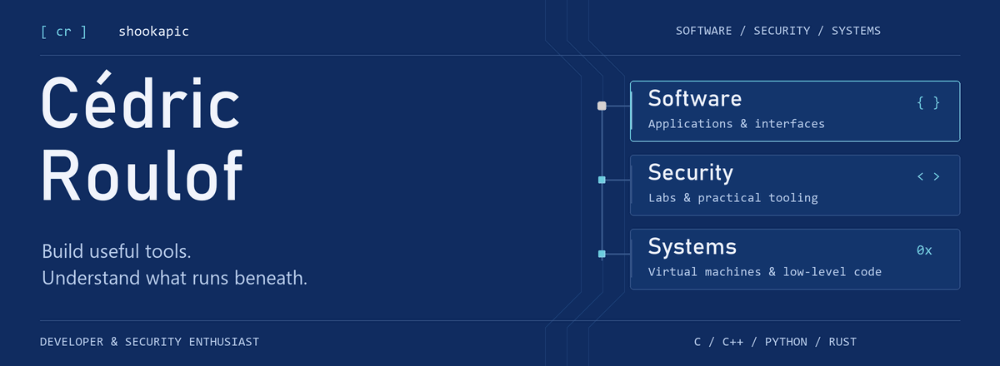

  
   
  <a href="./assets/profile-header-static.png">View static banner</a>

  <a href="https://re.linkedin.com/in/c%C3%A9dric-roulof-494026258">LinkedIn</a>
  &nbsp;·&nbsp;
  <a href="mailto:cedric.roulof@epitech.eu">Email</a>
  &nbsp;·&nbsp;
  <a href="https://github.com/shookapic?tab=repositories">Explore my repositories</a>

## About me

I'm **Cédric Roulof**, a developer and cybersecurity enthusiast. I build tools that make technical work easier, from persistent security lab environments to desktop applications and a virtual CPU built from scratch.

My interests meet where **software development, security, and low-level systems** overlap. I like understanding how things work beneath the interface, then turning that understanding into something useful.

## Selected projects

| Project | What it does | Built with |
| :--- | :--- | :--- |
| **[RangeDock](https://github.com/shookapic/rangedock)** | Named, persistent security lab workspaces with an interactive console, VPN profiles, and optional MCP integration. | Python · Docker |
| **[Ace](https://github.com/shookapic/Ace)** | A desktop AI chat overlay with streaming responses, file attachments, voice input, and conversation history. | Rust · Tauri · React · TypeScript |
| **[TinyVM](https://github.com/shookapic/TinyVM)** | An educational 64-bit virtual machine with a custom instruction set, assembler, and bytecode execution loop. | C++ · CMake |
| **[Flowfy](https://github.com/shookapic/Flowfy)** | A workflow automation project connecting services, with a containerized frontend and backend. | Docker Compose · PostgreSQL |
| **[Minishell](https://github.com/shookapic/Minishell)** | A minimal command-line shell built in C. | C · Make |

Also explore **[ASCII_Art](https://github.com/shookapic/ASCII_Art)** — C++ tools that turn video and live webcam input into ASCII art.

## Technical interests

- **Systems programming:** C, C++, virtual machines, and command-line tools.
- **Security tooling:** containerized labs, reproducible workspaces, and practical cybersecurity learning.
- **Application development:** React, TypeScript, and native desktop interfaces with Tauri.
- **Continuing to explore:** Unreal Engine 5 and game development.

## Let's connect

Interested in security tooling, systems programming, or building useful applications? Get in touch.

**[LinkedIn](https://re.linkedin.com/in/c%C3%A9dric-roulof-494026258)** · **[cedric.roulof@epitech.eu](mailto:cedric.roulof@epitech.eu)**  
Discord: `shookapic`
